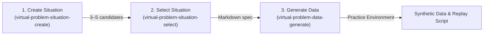

[한글](README.md)

# Virtual Problem Situation Skills (virtual-problem-skills)

An agent skill suite that generates **job-family-based realistic workplace problem scenarios and synthetic practice datasets (including replay scripts)** step by step, designed for education and student portfolios.

Real workplace inefficiencies and problems are rarely shared externally due to confidentiality and domain barriers. `virtual-problem-skills` takes a job family and role, designs plausible daily bottlenecks and operational friction, and builds an environment where learners can directly experience and reproduce these issues through synthetic data and simulation scripts.

> **Design Philosophy**  
> This toolkit focuses strictly on **defining the problem situation and building the simulation environment**. It does not provide solutions or automated code. The learner is intended to diagnose the root cause and engineer their own solution (via automation, data pipelines, AI agents, etc.). Not every problem needs to be solved with AI.

---

## Skills & Workflow

The 3 skills are connected in a sequential pipeline:



| Step | Skill | Input | Output | Description |
| :--- | :--- | :--- | :--- | :--- |
| **Step 1** | [`virtual-problem-situation-create`](skills/virtual-problem-situation-create/SKILL.md) | Job family, role, (optional) business context | 3–5 problem candidate cases | Daily repetitive bottlenecks, time/cost estimates, and required input file formats |
| **Step 2** | [`virtual-problem-situation-select`](skills/virtual-problem-situation-select/SKILL.md) | 1 chosen case, (optional) selection reason | Single situation markdown file (`.md`) | Freezes the selected case specification into a standard markdown file for data synthesis |
| **Step 3** | [`virtual-problem-data-generate`](skills/virtual-problem-data-generate/SKILL.md) | Markdown file from Step 2 | Practice folder (data, scripts, guide) | Generates synthetic workplace data with real-world noise and a Python replay script simulating current manual friction |

* Sample Scenario Output: [Accounting & Logistics Example](examples/accounting-logistics.md)

---

## Output Directory Structure

Once Step 3 completes, an independent project directory is generated for the learner to practice and solve:

```text
<situation_folder>/
├── README.md             # Student assignment guide (problem definition & goal)
├── schema.md             # Data schema and field context explaining why operators inspect it
├── data/                 # Operational input data (includes real-world noise, typos, discrepancies)
│   ├── day_inbox.csv     # Inbound daily tasks/records
│   ├── lookup.csv        # Master lookup data for cross-checking
│   └── rework_log.csv    # Log of tasks rejected or reopened
├── hidden/               # Evaluation reference data (restricted during student exercise)
│   ├── ground_truth.csv  # Ground truth mapping
│   └── cost_assumptions.json # Operational time and cost parameters
└── <replay_script>.py    # Python script simulating current inefficient manual inspection
```

---

## Installation

### Prerequisites
* **Basic Setup & Execution**: Node.js 18+ and `npx`
* **Running Replay Scripts**: Python 3

### 1. Install via Claude Code Plugin (Recommended)
In [Claude Code](https://claude.com/claude-code), install all skills at once through the plugin marketplace:

```bash
/plugin marketplace add sjnqkqh/virtual-problem-skills
/plugin install virtual-problem-skills@virtual-problem-skills
```

Skills will be available under the `/virtual-problem-skills:<skill-name>` namespace.

### 2. Global Install via npx CLI (Cursor, Codex, etc.)
Run the `npx skills` command in your terminal for global installation:

```bash
# Install all skills
npx --yes skills add sjnqkqh/virtual-problem-skills --all -g

# Install a specific skill
npx --yes skills add sjnqkqh/virtual-problem-skills --skill virtual-problem-situation-create -g
```

> For manual installation or other agent environments, refer to [Installation Guide](docs/install.md).

---

## Quick Start (Usage)

Once installed, invoke the skills sequentially in your conversation with an AI agent (Claude Code, Cursor, etc.).

### Step 1: Create Problem Situations
Provide the job family and role to generate virtual problem candidates:
```text
/virtual-problem-skills:virtual-problem-situation-create
Job Family: Accounting
Role: Logistics
```
*(The agent outputs 3–5 realistic problem situations with operational friction and cost analyses.)*

### Step 2: Select a Problem Situation
Select your preferred case to freeze into a markdown file:
```text
/virtual-problem-skills:virtual-problem-situation-select
Selection: Case 1 (Reconciling Carrier Invoices with Transit Logs)
```
*(The agent creates a single markdown file, e.g., `carrier-invoice-transit-log-reconciliation.md`.)*

### Step 3: Generate Practice Data & Replay Script
Point to the generated markdown file to build the full practice environment:
```text
/virtual-problem-skills:virtual-problem-data-generate
Input: carrier-invoice-transit-log-reconciliation.md
```
*(The practice directory with synthetic datasets and simulation scripts is created.)*

---

## License

[MIT License](LICENSE)
