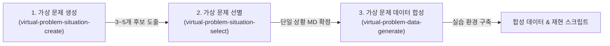

[English](README.en.md)

# 가상 문제 상황 스킬 (virtual-problem-skills)

실제 현장 데이터를 접하기 어려운 교육 환경 및 취업 준비생을 위해, **직군·직종 기반의 현실적인 가상 업무 문제 상황과 실습용 합성 데이터셋(재현 스크립트 포함)**을 단계별로 생성해 주는 에이전트 스킬 모음입니다.

실무 현장의 비효율과 문제는 기업 기밀이나 도메인 특성상 외부에 공개되기 어렵습니다. `virtual-problem-skills`는 직군과 직종 정보만으로 현장에서 실제로 일어날 법한 반복 업무와 병목 시나리오를 만들고, 이를 직접 데이터와 스크립트로 재현해 볼 수 있는 실습 환경을 빌드합니다.

> **설계 철학**  
> 본 도구는 **문제 정의와 실습 환경 구축**까지만 지원하며, 해결책이나 자동화 코드를 직접 제공하지 않습니다. 문제의 원인을 파악하고 해결책(자동화, 데이터 파이프라인, AI 에이전트 등)을 설계하는 과정은 학습자가 직접 수행하도록 유도합니다. (모든 문제를 인공지능으로 해결할 필요는 없습니다.)

---

## 제공 스킬 및 워크플로우

3가지 스킬이 단계별 파이프라인으로 연결되어 있습니다.



| 단계 | 스킬 | 입력 | 산출물 | 설명 |
| :--- | :--- | :--- | :--- | :--- |
| **1단계** | [`virtual-problem-situation-create`](skills/virtual-problem-situation-create/SKILL.md) | 직군, 직종, (선택) 업무 맥락 | 문제 상황 후보 3~5개 | 매일 반복되는 업무 병목, 시간/비용 추정, 필요한 입력 파일 형식 정의 |
| **2단계** | [`virtual-problem-situation-select`](skills/virtual-problem-situation-select/SKILL.md) | 후보 중 1개 선택, (선택) 선정 사유 | 단일 상황 마크다운 문서 (`.md`) | 다음 단계 데이터 합성을 위해 선택한 문제 명세를 표준 규격 파일로 고정 |
| **3단계** | [`virtual-problem-data-generate`](skills/virtual-problem-data-generate/SKILL.md) | 2단계 마크다운 문서 | 실습 폴더 (데이터, 스크립트, 가이드) | 노이즈가 포함된 실무 합성 데이터와 현재 업무의 비효율을 시뮬레이션하는 재현 스크립트 생성 |

## 단계별 산출물 쇼케이스 (Showcase)

`virtual-problem-skills`의 3단계 파이프라인을 거쳐 최종적으로 어떤 실습 환경과 데이터가 만들어지는지 실제 생성된 예시를 통해 확인할 수 있습니다:

1. **[1단계 문제 후보 생성 예시](examples/accounting-logistics.md)**:
   - 직군(회계)과 직종(물류)을 입력받아 도출된 3가지 현실적인 가상 문제 상황 후보
2. **[2단계 문제 선별 명세서 예시](examples/운송사-청구서-운행-기록-맞추기.md)**:
   - 후보 중 1번 상황을 선정하여 단일 표준 마크다운 명세서로 확정한 문서
3. **[3단계 최종 실습 패키지 (데이터셋 & 재현 스크립트)](examples/운송사-청구서-운행-기록-맞추기/)**:
   - [과제 안내서 (`README.md`)](examples/운송사-청구서-운행-기록-맞추기/README.md) 및 [데이터 스키마 (`schema.md`)](examples/운송사-청구서-운행-기록-맞추기/schema.md)
   - [수작업 재현 스크립트 (`reconcile_carrier_invoices.py`)](examples/운송사-청구서-운행-기록-맞추기/reconcile_carrier_invoices.py): PDF 청구서와 회전/기울임/원거리 노이즈가 포함된 JPG 인수증을 대조하여 20%의 재작업과 인건비 손실을 출력하는 시뮬레이션 코드
   - [실습용 바이너리 데이터셋 (`data/`)](examples/운송사-청구서-운행-기록-맞추기/data/): 실제 40건의 [청구서 PDF](examples/운송사-청구서-운행-기록-맞추기/data/invoices_pdf/)와 스마트폰 촬영 [인수증 JPG](examples/운송사-청구서-운행-기록-맞추기/data/receipts_jpg/) 및 대조 마스터 CSV
   - [채점용 기준 데이터 (`hidden/`)](examples/운송사-청구서-운행-기록-맞추기/hidden/): 인건비 가정치 JSON 및 정답/노이즈 메타데이터 CSV

---

## 최종 산출물 구조

3단계 데이터 합성까지 완료되면, 학습자가 즉시 실습하거나 과제로 해결해 볼 수 있는 독립된 디렉토리가 생성됩니다.

```text
<문제상황_폴더>/
├── README.md             # 학생용 과제 안내서 (문제 정의 및 실습 목표)
├── schema.md             # 데이터 필드 명세 및 현장 담당자가 확인하는 이유
├── data/                 # 현장 입력 데이터 (오타, 서식 불일치, 누락 등 실제 노이즈 포함)
│   ├── day_inbox.csv     # 당일 유입 업무 데이터
│   ├── lookup.csv        # 대조용 기준 마스터 데이터
│   └── rework_log.csv    # 오류로 인한 재작업 발생 기록
├── hidden/               # 채점 및 평가용 기준 데이터 (실습 중 열람 제한)
│   ├── ground_truth.csv  # 정답 매핑 데이터
│   └── cost_assumptions.json # 업무 시간 및 비용 가정치
└── <재현_스크립트>.py     # 수작업 대조/처리 과정을 시뮬레이션하는 Python 스크립트
```

---

## 설치 방법

### 사전 요구사항
* **기본 설치 및 실행**: Node.js 18 이상 및 `npx`
* **재현 스크립트 실행**: Python 3

### 1. Claude Code 플러그인 설치 (권장)
[Claude Code](https://claude.com/claude-code) 환경에서는 마켓플레이스를 통해 전체 스킬을 한 번에 설치할 수 있습니다.

```bash
/plugin marketplace add sjnqkqh/virtual-problem-skills
/plugin install virtual-problem-skills@virtual-problem-skills
```

설치 후에는 `/virtual-problem-skills:<스킬 이름>` 네임스페이스로 스킬을 호출할 수 있습니다.

### 2. npx CLI로 전역 설치 (Cursor, Codex, 기타 환경)
터미널에서 `npx skills` 명령어로 전역 설치합니다.

```bash
# 전체 스킬 설치
npx --yes skills add sjnqkqh/virtual-problem-skills --all -g

# 특정 스킬만 개별 설치
npx --yes skills add sjnqkqh/virtual-problem-skills --skill virtual-problem-situation-create -g
```

> 수동 설치 및 기타 에이전트 설정에 대한 상세한 내용은 [설치 방법 가이드](docs/install.md)를 참고하세요.

---

## 빠른 시작 (사용법)

설치 후 AI 에이전트(Claude Code, Cursor 등)와의 대화창에서 단계별로 호출하여 사용합니다.

### 1단계: 문제 상황 생성
에이전트에게 직군과 직종을 전달하여 가상 문제 후보를 요청합니다.
```text
/virtual-problem-skills:virtual-problem-situation-create
직군: 회계
직종: 물류
```
*(에이전트가 현실적인 제약 사항과 비용 분석이 포함된 3~5개의 문제 후보를 제시합니다.)*

### 2단계: 문제 상황 선별
제시된 후보 중 실습에 사용할 상황을 선택하여 파일로 저장합니다.
```text
/virtual-problem-skills:virtual-problem-situation-select
선택: 1번 (운송사 청구서와 운행 기록 맞추기)
```
*(선택한 상황이 단일 마크다운 파일(예: `운송사-청구서-운행-기록-맞추기.md`)로 생성됩니다.)*

### 3단계: 실습 데이터 및 스크립트 생성
생성된 마크다운 파일을 지정하여 실습 환경 구축을 요청합니다.
```text
/virtual-problem-skills:virtual-problem-data-generate
입력: 운송사-청구서-운행-기록-맞추기.md
```
*(합성 데이터셋과 비효율 재현 스크립트가 포함된 실습 폴더가 생성됩니다.)*

---

## 라이선스

[MIT License](LICENSE)
